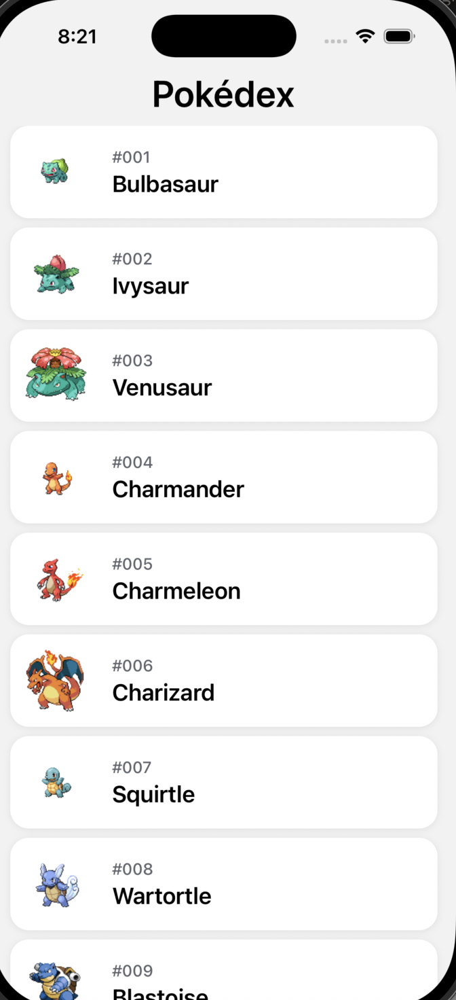
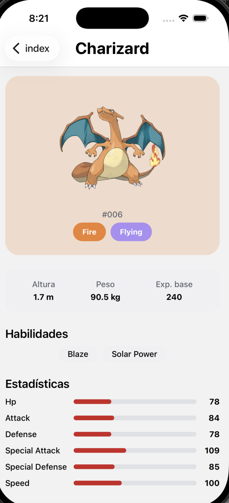

# Pokédex Challenge

App de React Native (Expo + TypeScript) que lista los primeros Pokémon de [PokéAPI](https://pokeapi.co/) y permite ver el detalle de cada uno. Guarda en cache lo último que se vio para poder seguir consultándolo sin conexión.

## Capturas

<p>
  
  
</p>

[Video corto de la app en uso](docs/screenshots/demo.mov)

## Requisitos previos

- Node.js 20+
- [Yarn](https://yarnpkg.com/) (el proyecto fija `"packageManager": "yarn@4.14.1"` en `package.json`, vía [Corepack](https://nodejs.org/api/corepack.html))
- Xcode (simulador iOS) y/o Android Studio (emulador Android), o la app **Expo Go** en un dispositivo físico

## Instalación y ejecución

```bash
yarn install
yarn expo start
```

Desde la terminal de Metro: `i` abre el simulador de iOS, `a` el emulador de Android, `w` la versión web. También hay scripts directos:

```bash
yarn ios
yarn android
yarn web
```

## Tests, linting y formateo

```bash
yarn test           # unit tests (Jest) sobre services, store y types
yarn lint
yarn format          # Prettier sobre todo el repo
yarn format:check    # falla si hay algo sin formatear (sin escribir cambios)
```

Un hook de pre-commit (Husky + lint-staged) corre `eslint --fix` y `prettier --write` sobre los archivos staged en cada commit automáticamente.

## Arquitectura

Clean Architecture organizada **por capa** (no por feature): cada carpeta de primer nivel dentro de `src/` es una responsabilidad, y adentro conviven los archivos de las dos pantallas (listado y detalle).

```
app/                    # rutas de expo-router — el JSX de cada screen vive acá
  index.tsx               # listado
  pokemon/[id].tsx         # detalle
  _layout.tsx

src/
  components/            # UI pura, sin llamadas a red ni storage. Una carpeta por componente:
    text/ screen/ pokemonListItem/ typeBadge/ statBar/ infoRow/ listSeparator/
    pokemonSummary/ pokemonInfoCard/ pokemonAbilities/ pokemonStats/
    pokemonDetailHeaderTitle/     # título custom del header nativo del detalle
    skeleton/ pokemonListItemSkeleton/ pokemonListSkeleton/  # placeholders animados
    loadingState/ errorState/ emptyState/     # estados de carga/error/vacío reusables

  services/              # acceso a datos: qué se pide y con qué estrategia
    http.ts                # wrapper de fetch (timeout, errores tipados)
    pokemonListService.ts   # GET /pokemon — red primero, cache como fallback
    pokemonDetailService.ts # GET /pokemon/{id} — misma estrategia
    hooks/                 # "casos de uso": orquestan el service + exponen estado a la UI
      usePokemonList.ts + usePokemonList.types.ts
      usePokemonDetail.ts + usePokemonDetail.types.ts

  store/                 # todo lo que toca AsyncStorage
    storage.ts              # wrapper de AsyncStorage (get/set/remove con JSON)
    pokemonListStore.ts      # cache de páginas del listado, por offset+limit
    pokemonDetailStore.ts    # cache de detalle, por id/nombre

  hooks/                 # hooks que no dependen de un service (tema, color scheme)
  constants/             # theme.ts, typography.ts, typeColors.ts, pokemonAssets.ts,
                          # apiEndpoints.ts, routes.ts, strings.ts, requestStatus.ts,
                          # requestAction.ts
  types/                 # entidades + DTOs de PokéAPI + jerarquía de errores tipados
  utils/                 # helpers puros (capitalize, etc.)

__tests__/               # espeja la estructura de src/
```

**Separación de responsabilidades:** los componentes de `components/` no importan nada de `services/` ni `store/` — reciben todo por props o lo leen de un hook. Los hooks de `services/hooks/` son la única capa que decide _cuándo_ pedir datos y _cómo_ mapear el resultado a estado de UI (loading/error/success/empty). Los archivos de `services/` son la única capa que sabe que existe HTTP. Los archivos de `store/` son la única capa que sabe que existe AsyncStorage. Ese orden de importación (UI → services/hooks → services → store) nunca se invierte.

**Inversión de dependencias, versión módulo en vez de clase:** no hay una interfaz `PokemonRepository` ni un contenedor de DI con `new`. En su lugar, `usePokemonList` depende únicamente de la _firma_ de `getPokemonList(params)`, no de cómo está implementada — el desacople existe igual (se puede reemplazar la implementación de `pokemonListService.ts` sin tocar el hook, y se puede mockear el módulo entero con `jest.mock('@/services/pokemonListService')` en un test) — solo que la abstracción es el límite del módulo de ES en vez de una interfaz de TypeScript. Es el mismo principio (SOLID – DIP) con una implementación más liviana, coherente con no traer un framework de DI para una app de dos pantallas.

**Manejo de errores:** cada capa de datos lanza errores tipados (`NetworkError`, `NotFoundError`, `StorageError`, `UnknownError`, en `src/types/errors.ts`) en vez de dejar pasar excepciones genéricas. `ErrorState` mapea cada tipo a un mensaje en español, evitando mostrarle al usuario un stack trace.

### Estrategia de persistencia

Cache **network-first con fallback a cache**: cada pantalla intenta la red primero; si falla (sin conexión, timeout, error del servidor), se muestra la última respuesta cacheada para esa misma página/Pokémon. Una respuesta exitosa siempre refresca la cache. Lo elegí sobre un enfoque "cache-first" porque prioriza mostrar el dato más actualizado posible, y solo recurre a lo guardado cuando realmente no hay forma de llegar a la red — así se puede seguir viendo lo que ya se cargó sin conexión, sin necesitar sincronización bidireccional (acá todo es de solo lectura).

Se usa `AsyncStorage` (clave/valor, todo agrupado en `src/store/`) en vez de SQLite porque el dato a persistir es simple — listas y objetos de Pokémon ya mapeados a JSON — y no hay relaciones entre entidades que justifiquen una base relacional.

### Paginación

El listado pide de a 20 Pokémon (`usePokemonList`), con carga incremental al llegar al final del `FlatList` (`onEndReached`) y pull-to-refresh. El estado de la pantalla es una máquina de estados explícita (`loading | refreshing | loading-more | success | empty | error`) manejada con `useReducer`, para no perder de vista ningún caso (por ejemplo: un refresh fallido no debe reemplazar la lista ya cargada por una pantalla de error en blanco).

## Librerías utilizadas

Traté de mantener las dependencias al mínimo posible: **nada que resuelva el problema de negocio por mí** (sin manejo de estado tipo Redux, sin cliente HTTP tipo Axios, sin UI kits). Las únicas librerías que agregué son infraestructura básica sin una alternativa razonable dentro del ecosistema Expo:

| Librería                                                 | Uso                                          | Por qué                                                                                                       |
| -------------------------------------------------------- | -------------------------------------------- | ------------------------------------------------------------------------------------------------------------- |
| `expo-router`                                            | Navegación (listado → detalle)               | Viene con el template de Expo; armar un stack nativo propio sería mucho más código y más frágil.              |
| `expo-image`                                             | Sprites con cache en disco                   | Paquete oficial de Expo, evita re-descargar imágenes ya vistas.                                               |
| `@react-native-async-storage/async-storage`              | Persistencia local (`src/store/`)            | Dejó de ser parte del core de RN desde 0.60, pero sigue siendo el estándar de facto para storage clave/valor. |
| `react-native-safe-area-context`, `react-native-screens` | Requeridas por `expo-router`/el stack nativo | Vienen con el template, no se agregaron a mano.                                                               |
| `jest`, `ts-jest`, `eslint`, `eslint-config-expo`        | Testing y linting                            | Dev-only, no viajan a producción.                                                                             |
| `prettier`, `husky`, `lint-staged`                       | Formateo y pre-commit                        | Dev-only. `lint-staged` corre `eslint --fix` + `prettier --write` en cada commit (`.husky/pre-commit`).       |

Toda la lógica de red usa `fetch` nativo (wrappeado en `services/http.ts`), sin cliente HTTP de terceros.

## Estados de UI

Cada pantalla contempla carga, error y vacío con componentes reusables en `src/components/`: `LoadingState`, `ErrorState` (con botón de reintentar y mensaje según el tipo de error) y `EmptyState`.

## UX y rendimiento

- **Skeleton loading**: en la primera carga del listado, en vez de un spinner genérico se muestran filas placeholder (`PokemonListSkeleton` → `PokemonListItemSkeleton` → `Skeleton`) con la misma forma que `PokemonListItem`, con un pulso animado. Se ve aunque la respuesta de la API sea instantánea — es intencional, para que quede visible que está implementado.
- **Stat bars animadas**: en el detalle, cada barra de estadística anima su ancho de 0 al valor real al montar la pantalla (`Animated.timing`, 800ms) en vez de aparecer ya llena.
- **Header nativo dinámico**: la pantalla de detalle usa `<Stack.Screen options={{ headerTitle: ... }} />` (patrón de expo-router) para reemplazar el título nativo por un componente propio (`PokemonDetailHeaderTitle`) una vez que el Pokémon carga, con el nombre en un tamaño más prominente que el default del header — y centrado en ambas plataformas (`headerTitleAlign`, que Android no centra por defecto).
- **Tarjeta tintada por tipo**: el bloque de imagen del detalle (`PokemonSummary`) usa un tinte de fondo derivado del tipo principal del Pokémon (`TYPE_COLORS` + alpha) en vez de un fondo plano — el color comunica algo real, no es solo decorativo.
- **`React.memo`** en `PokemonListItem`: evita re-renders de filas que no cambiaron mientras la lista pagina o se refresca (las referencias de los ítems ya cargados se mantienen estables en `usePokemonList`).
- **`maxWidth`** (`constants/theme.ts`) en los contenedores principales: evita que el contenido se estire de punta a punta en tablets o en la versión web.
- Toda animación usa `Animated` nativo de React Native — sin librerías de animación de terceros.

## Pendientes / trade-offs

- Los tests cubren `services`, `store` y `types` (mappers, estrategia de red-primero-cache, errores tipados) porque es donde vive la lógica de negocio; no se agregaron tests de componentes/hooks de UI para no sumar una librería de testing de UI (`@testing-library/react-native`) fuera del alcance ya justificado arriba.
- El listado no tiene búsqueda ni filtros — no lo vi necesario para una lista paginada de a 20 ítems.
- No configuré integración continua (CI); con el lint y el formateo corriendo en el pre-commit me pareció suficiente control de calidad para el tamaño de este proyecto.
